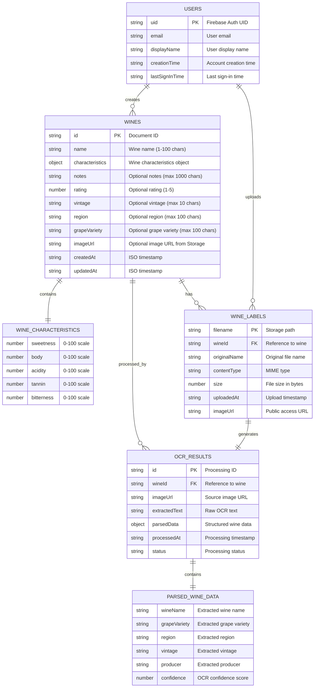
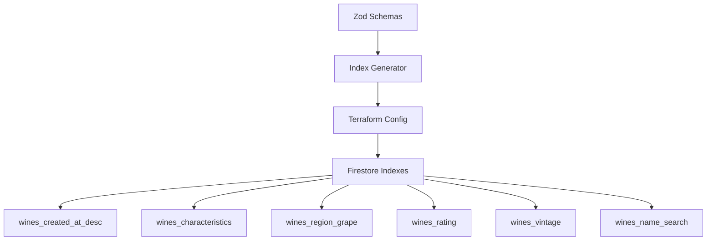

# Wine Memo - Entity Relationship Diagram

## Database Schema Overview

This ER diagram represents the data model for the Wine Memo application, which uses Firebase Firestore as the primary database and Firebase Storage for image files.

## Collection Structure in Firestore

### Main Collections

1. **`wines`** - Primary collection for wine records
   - Document ID: Auto-generated or timestamp-based
   - Fields: All wine properties including embedded characteristics

2. **No separate collections for:**
   - Users (managed by Firebase Auth)
   - Wine characteristics (embedded in wine documents)
   - OCR results (temporary processing data)

### Storage Structure

1. **`wine-labels/`** - Firebase Storage bucket
   - Path: `wine-labels/{wineId}/{timestamp}-{filename}`
   - Public access for image display

### Indexes (Auto-generated from Zod schemas)

## Key Features

### Schema-Driven Architecture
- **Zod schemas** define validation rules
- **Auto-generated indexes** from schema patterns
- **Type-safe operations** with TypeScript

### Security Rules
- Authenticated users can read all wines
- Authenticated users can create/update/delete wines
- Image uploads require authentication
- OCR processing via Firebase Functions

### Data Flow
1. User creates wine record → Firestore
2. User uploads image → Firebase Storage
3. Image triggers OCR → Firebase Functions
4. OCR results update wine record → Firestore

## Validation Rules

### Wine Creation Schema
- Name: Required, 1-100 characters
- Characteristics: Required object with 5 numeric fields (0-100)
- Optional fields: notes, rating, vintage, region, grapeVariety
- Timestamps: Auto-generated on creation/update

### Wine Update Schema
- ID: Required for identification
- All other fields: Optional for partial updates
- UpdatedAt: Auto-updated on modification

### Search Schema
- Characteristics: Partial matching with tolerance
- Region, grapeVariety: Exact string matching
- Rating: Range-based filtering
- Pagination: Limit and offset support 